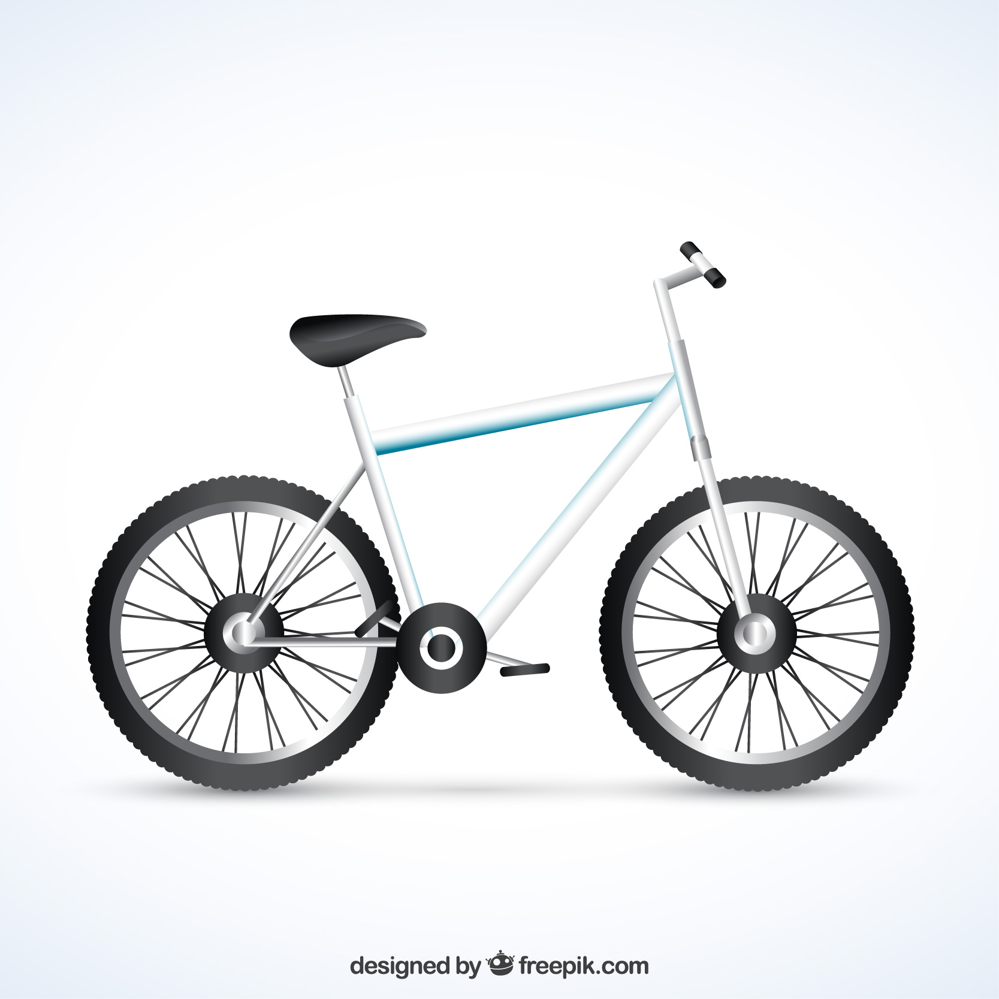

# What is it an object in OOP?

We can describe an object as an abstract representation of a real-world entity or idea. An object is primarily composed of two elements. First, there are the object's attributes, which are its characteristics, such as size, length, color, etc. We can think of attributes as the adjectives that describe a noun. Second, the object has methods, which define the actions the object can perform. These can be seen as the verbs that describe what a real-world entity can do or is designed to do, such as running, classifying, or requesting.

    

