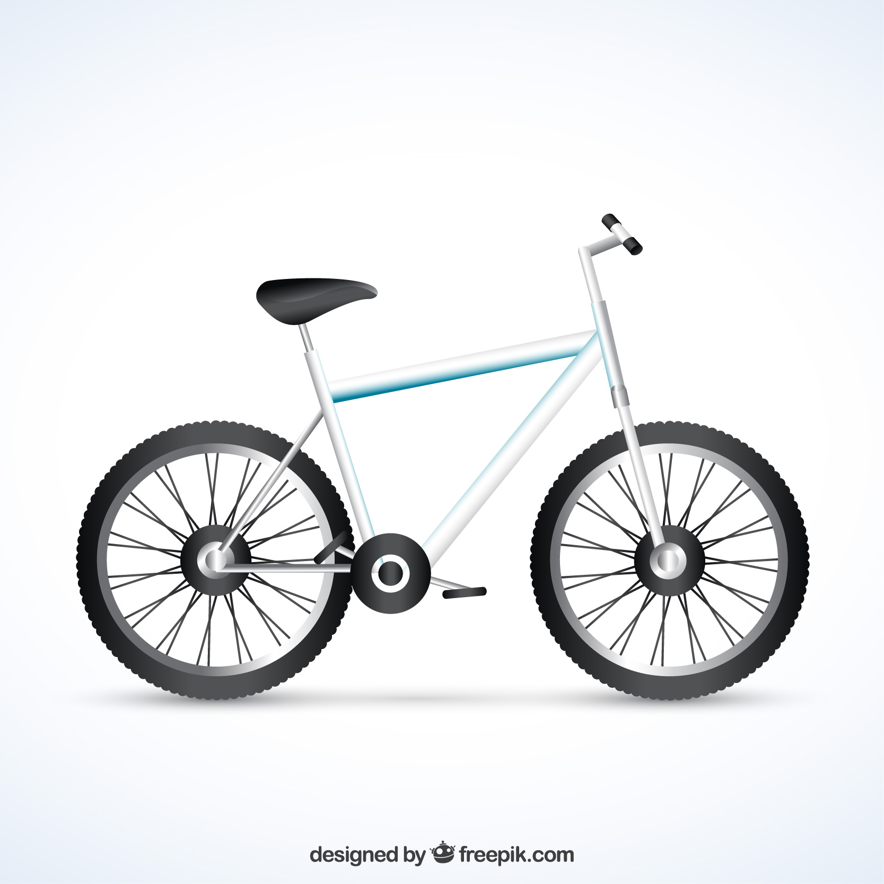

# What is it an object in OOP?

We can describe an object as an abstract representation of a real-world entity or idea. An object is primarily composed of two elements. First, there are the object's attributes, which are its characteristics, such as size, length, color, etc. We can think of attributes as the adjectives that describe a noun. Second, the object has methods, which define the actions the object can perform. These can be seen as the verbs that describe what a real-world entity can do or is designed to do, such as running, classifying, or requesting.


<center>
    <figure>
        
        <figcaption> <strong>Figure 1.</strong> Example of the real-word entity that need to be described [Object:Bike] </figcaption>
    </figure>
</center>

As a practical example, lets look **Figure 1**. Lets try to described the object bike.


* **Object:** Bike 
    * **Attributes**: 
        * **Frame:**
            * **Material:** Steel
            * **Color:** White 
            * **Quatity:** 1
        * **Wheel:**
            * **Material:** Rubber, 
            * **Geometry:** Circle, 
    * **Methods**:
        * Rocking: ....
        * Tilting: ....
        * Turning: ....

The previous definitions are the ones that characterize our object bike. This exercise can be extrapolated to more abstract ideas. And from this we will be able to create more complex elements, applications and representations. 

## Why did I start with this introduction to what an object is?

In Python :snake:, all variables :a:, data structures &#x02599; and even methods &#x1F504; are represented as objects. Because of the above, I think that having this simple idea of what an object is will be helpful while we go discovering and defining more in deep concepts. 

## Perhaps you have doubts about how our bike object will look using Python syntax?

Now we will see how it could look like the object bike using the Python syntax. I clarify that we will see a better representation and a series of execersies in the next sections, don't be afraid if this look a bit frainting, with time and practice you will domain and understand what each definition means and how to apply them to your projects.

```python
# Definition of the object
class Bike(TransportVehicle):
    
    #Object Contstructor
    def __init__(self):

        # Public attributes 
        self._frame = {
            'material': 'steel',
            'color': 'white',
            'quantity': 1
        }
        self._wheel = {
            'material': 'rubber',
            'geometry': 'circle'
        }
    
    # Public method
    def Rocking(self, value): 
        '''
            Action difinition goes here
        '''
        return ''

    # Public method
    def Tilting(self, angle):
        '''
            Action difinition goes here
        '''
        return ''

    # Public method
    def Turning(self, direction):
        '''
            Action difinition goes here
        '''
        return ''
```

## What next?
* [Hello world from python!](https://github.com/jrojas9206/workshop_pythonCV/tree/main/section_1_pythonIntroduction/s1d1-introductionScript)

**UPDATE:** 19.10.2024